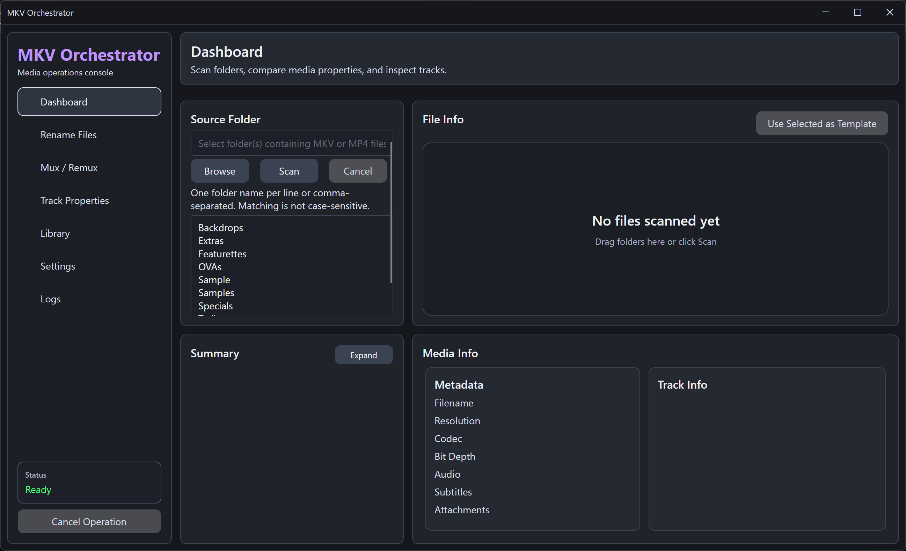
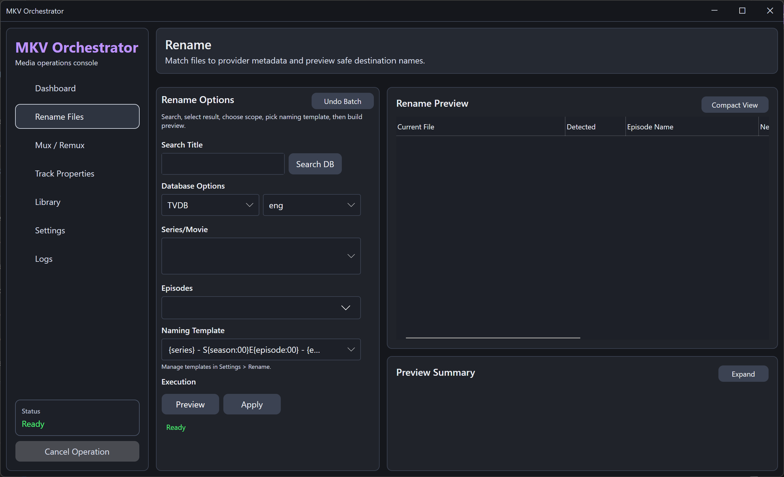
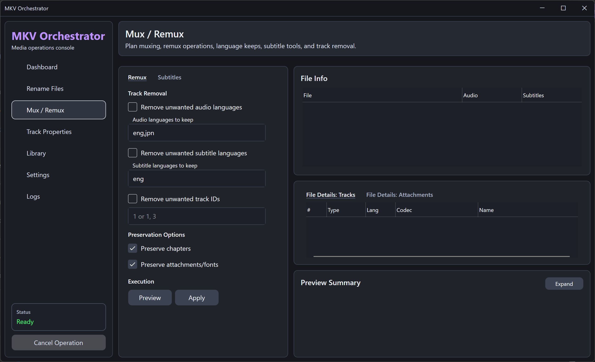
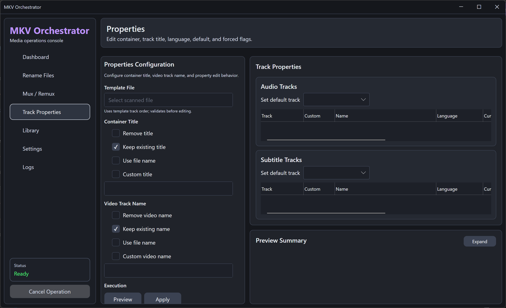
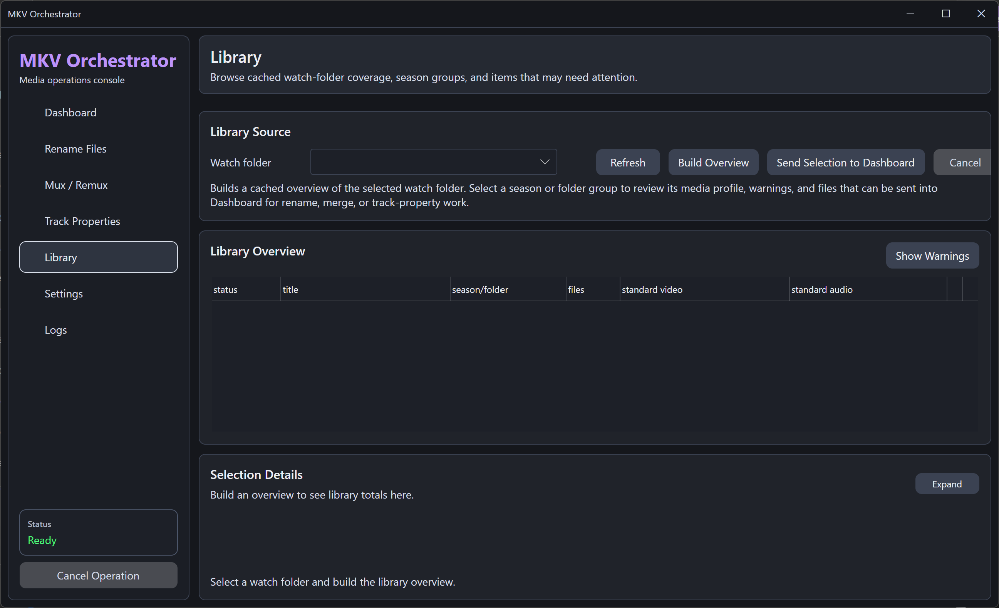
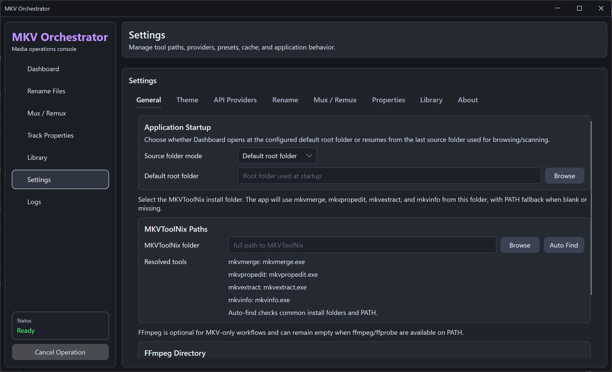
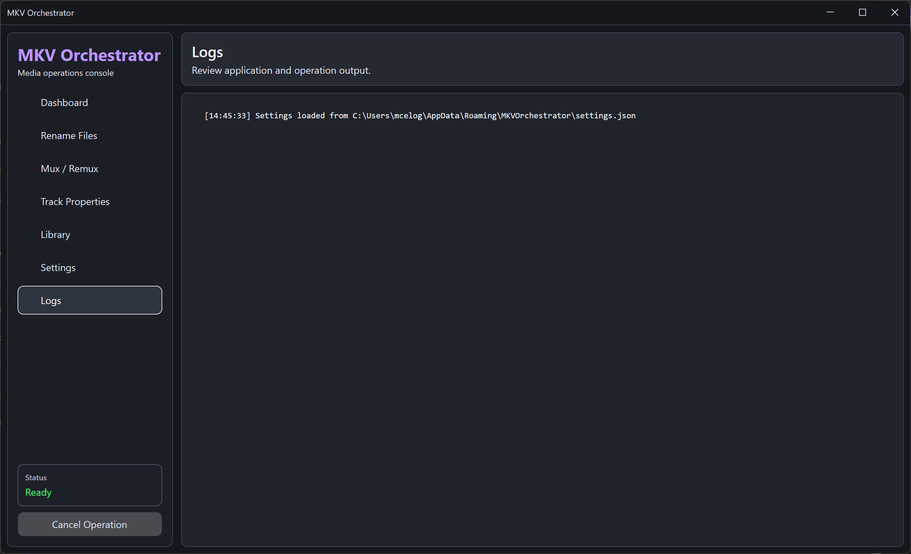

# MKV Orchestrator

MKV Orchestrator, or MKVO, is a desktop media operations console for scanning media folders, reviewing track metadata, matching rename metadata from TVDB or TMDB, previewing safe file renames, planning mux/remux work, and editing MKV track properties.

The app is built with Tauri and Rust. One React interface serves both the desktop app and the container, so a feature lands once and appears in both.

A Docker build is available for server or NAS-style access. Desktop and container run the same Rust core; they differ only in how they are reached and in how far they may browse -- the desktop browses the whole machine, the container stays inside the roots it was given.

## What MKVO Does

- Scans folders for MKV and MP4 files.
- Displays file, video, audio, and subtitle track details.
- Compares files against a selected template file.
- Looks up TV or movie metadata from TVDB or TMDB for rename previews.
- Supports rename templates for TV episodes and movies.
- Records rename batches so recent rename operations can be reviewed and undone.
- Plans MKV mux/remux operations with MKVToolNix.
- Muxes matching external subtitle sidecars into MKV files.
- Converts MP4 files to MKV with a lossless container copy (no re-encoding), with optional cleanup of the original MP4.
- Edits MKV container title, track names, languages, default flags, and forced flags.
- Builds and manages a local metadata cache for watch folders.
- Discovers library paths from Emby, Jellyfin, or Plex servers with per-library enablement and path mapping.
- Supports user-editable GUI themes.

## Screenshots

### Dashboard



### Rename Files



### Mux / Remux



### Track Properties



### Library



### Settings



### Logs



Screenshots live in [`docs/screenshots/`](docs/screenshots/); see that folder's README for naming conventions when adding new captures.

## Requirements

### Required For Running From Source

- Windows desktop environment. Linux and macOS build from the same sources.
- Rust 1.88 or newer.
- Node.js 22 or newer.
- Git, if you are cloning from GitHub.

### Required Media Tools

Install these separately. MKVO does not bundle them.

#### MKVToolNix

MKVToolNix is required for MKV analysis, remuxing, extraction, and metadata editing.

MKVO expects access to these executables:

- `mkvmerge`
- `mkvpropedit`
- `mkvextract`
- `mkvinfo`

On Windows, install MKVToolNix from:

https://mkvtoolnix.download/

Then configure the install folder in:

```text
Settings > General > MKVToolNix Paths
```

Use the folder that contains the tools, for example:

```text
C:\Program Files\MKVToolNix
```

You can also use **Auto Find** if MKVToolNix is installed in a common location or available on PATH.

#### FFmpeg And ffprobe

FFmpeg and ffprobe are used for additional media inspection and MP4 readability support.

MKVO expects access to:

- `ffmpeg`
- `ffprobe`

Install FFmpeg from:

https://ffmpeg.org/

Then configure the FFmpeg `bin` folder in:

```text
Settings > General > FFmpeg Directory
```

Example:

```text
C:\ffmpeg\bin
```

You can also use **Auto Find** if FFmpeg is installed in a common location or available on PATH.

## Metadata Provider API Keys

MKVO does not ship shared TVDB or TMDB production API keys.

Each user must provide their own API credentials for rename metadata lookup.

Configure provider credentials in:

```text
Settings > API Providers
```

Supported providers:

- TVDB
- TMDB

TVDB is used for TV and movie metadata lookup through TheTVDB.

TMDB is used for TV and movie metadata lookup through The Movie Database.

The app masks key fields, stores keys locally in the user settings file, and does not write API keys to logs.

Provider setup links are shown inside the app under Settings.

## First-Run Setup

1. Install MKVToolNix.
2. Install FFmpeg.
3. Open MKVO.
4. Go to `Settings > General`.
5. Set the MKVToolNix folder or click **Auto Find**.
6. Set the FFmpeg folder or click **Auto Find**.
7. Go to `Settings > API Providers`.
8. Enter your own TVDB and/or TMDB API key.
9. Click **Test Selected Provider** to confirm lookup access.
10. Go to Dashboard and scan one or more folders.

## Rename Workflow

1. Scan files from the Dashboard.
2. Go to Rename Files.
3. Search for the show or movie title.
4. Select the correct TVDB or TMDB result.
5. Confirm the episode scope or movie mode.
6. Choose a naming template.
7. Click **Preview**.
8. Review the Rename Preview table and Preview Summary.
9. Click **Apply** only when the preview is correct.

Rename batches are recorded locally. Use **Undo Batch** in Rename Options to review recent rename jobs and restore files when possible.

## Subtitle Mux Filename Format

External subtitle sidecars should be placed in the same folder as the matching MKV file.

Expected format:

```text
base_name.language.tag.ext
```

Example:

```text
Episode 01.mkv
Episode 01.eng.Dialogue.ass
Episode 01.eng.Signs & Songs.ass
Episode 01.jpn.Dialogue.ass
```

The language token is read from the filename. The tag token becomes the subtitle track name.

## Local Data And Privacy

MKVO stores user settings, local metadata cache files, and rename history locally on the machine.

Do not commit or publish local runtime files such as:

- API keys
- `settings.json`
- `metadata_cache*.db`
- local logs
- local publish output

The repository `.gitignore` excludes the common local runtime files.

## Build From Source

Build the workspace:

```powershell
cargo build --workspace
```

Run the desktop app with hot reload. This starts the Vite dev server and the
desktop host together, and must be run from the repository root -- that is where
the Tauri CLI finds `apps/desktop/src-tauri/tauri.conf.json`:

```powershell
.\web\node_modules\.bin\tauri.cmd dev
```

Run the tests:

```powershell
cargo test --workspace
```

```powershell
npm --prefix web test
```

## Command Line

The `mkvo` binary drives the same runtime as the app, against whichever
configuration directory it is pointed at.

```powershell
cargo run --package mkvo-cli -- scan "D:\Media\Show"
```

```text
mkvo scan <folder>    [--json] [--ignore Extras,Backdrops] [--force-refresh]
mkvo inspect <folder> [--ignore ...]                       # scan --json
mkvo cleanup <folder> [--apply] [--keep-container-title] [--keep-video-title]
                      [--remove-audio-titles] [--remove-subtitle-titles]
                      [--set-audio-language eng] [--set-subtitle-language eng]
mkvo rename <folder>  [--query "Series"] [--provider AniList] [--pick 2]
                      [--list-matches] [--template "..."] [--apply]
```

`cleanup` and `rename` only print a plan until you pass `--apply`.

Exit codes: `0` success, `1` error, `2` ran fine but found nothing to do, `130`
canceled. The `2` is what lets a script skip a follow-up step.

Settings come from `--config`, then `MKVO_CONFIG_DIR`, then the OS
configuration directory (`mkv-orchestrator`).

That is **not** the desktop app's store. The desktop keeps its configuration
under its Tauri identifier (`com.mkvorchestrator.desktop`) and its provider keys
in the OS credential store, while the CLI uses a protected file. Point both at
one directory with `--config` if you want a shared cache; the secrets still
differ, so provider keys have to be configured for each.

What is not shared is the working set: the list of files a running app has on
screen is that process's own state, so `mkvo scan` will not populate the
dashboard of a server or desktop that is already running. The cache it writes
does make that app's next scan faster.

Renaming goes through a provider lookup, so it needs something to search for;
without `--query` the folder name is used. AniList needs no credentials, the
others need keys configured in Settings.

The container carries the same binary:

```bash
docker exec mkvo mkvo scan /media --json
```

## Docker Web Container

The Docker build runs as one container. It serves the React web UI and the Rust API from the same process and installs MKVToolNix plus FFmpeg inside the image.

Build and run:

```powershell
docker compose up --build
```

Open:

```text
http://localhost:8886
```

Default local volume mounts:

```text
./tmp/docker-media     -> /media
./tmp/docker-downloads -> /downloads
./tmp/docker-config    -> /config
```

The web app browses container paths. With the default compose file, `/media` and `/downloads` are local bind mounts under `./tmp`.

For a NAS or SMB share, copy `.env.example` to `.env`, edit the share paths and CIFS options, then run:

```powershell
docker compose -f docker-compose.yml -f docker-compose.nas.example.yml up --build
```

Keep `.env` local. Do not commit API keys, SMB usernames, SMB passwords, or server-specific paths.

Optional container settings (see `docs/DOCKER_WEB_CONTAINER.md` for the full list):

- `PUID` / `PGID` / `UMASK` run the app as a specific user so files written to shares are not root-owned.
- `MKVO_AUTH_MODE` selects `disabled` (trusted LAN), `basic`, or the secure `auto` server default.
- `MKVO_AUTH_USERNAME` / `MKVO_AUTH_PASSWORD` are required together in `basic` mode.
- `MKVO_SCAN_WORKERS` and `MKVO_EDIT_WORKERS` tune scan and mkvpropedit concurrency.

The container wires Dashboard, Rename, Mux / Remux, Track Properties, Library, Settings, and Logs through the single Rust host, from the same React sources the desktop app embeds.

Publish desktop installers:

```powershell
.\scripts\publish-windows.ps1
```

Bundles are written to `target/release/bundle`. The Linux equivalent is `scripts/publish-linux.sh`.

## Documentation

Additional notes are available in:

- `docs/API_PROVIDER_KEYS.md`
- `docs/ATTRIBUTION_AND_LOGOS.md`
- `docs/DOCKER_WEB_CONTAINER.md`
- `docs/VERSIONING_AND_MIGRATIONS.md`

## Attribution

MKVO uses external tools and metadata providers selected or configured by the user.

- MKVToolNix is used for MKV analysis, remuxing, extraction, and metadata editing.
- FFmpeg and ffprobe are used for media metadata inspection.
- This product uses the TMDB API but is not endorsed or certified by TMDB.
- Metadata may be provided by TheTVDB.

MKVO invokes MKVToolNix and FFmpeg as external tools and does not bundle or link their code in this repository. Those projects are distributed under their own licenses.

## License

MKV Orchestrator is released under the [MIT License](LICENSE).
