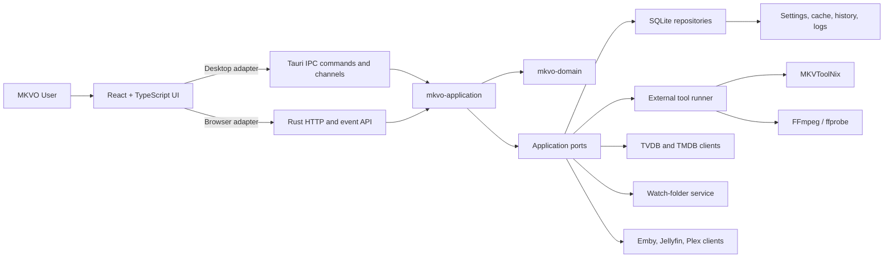
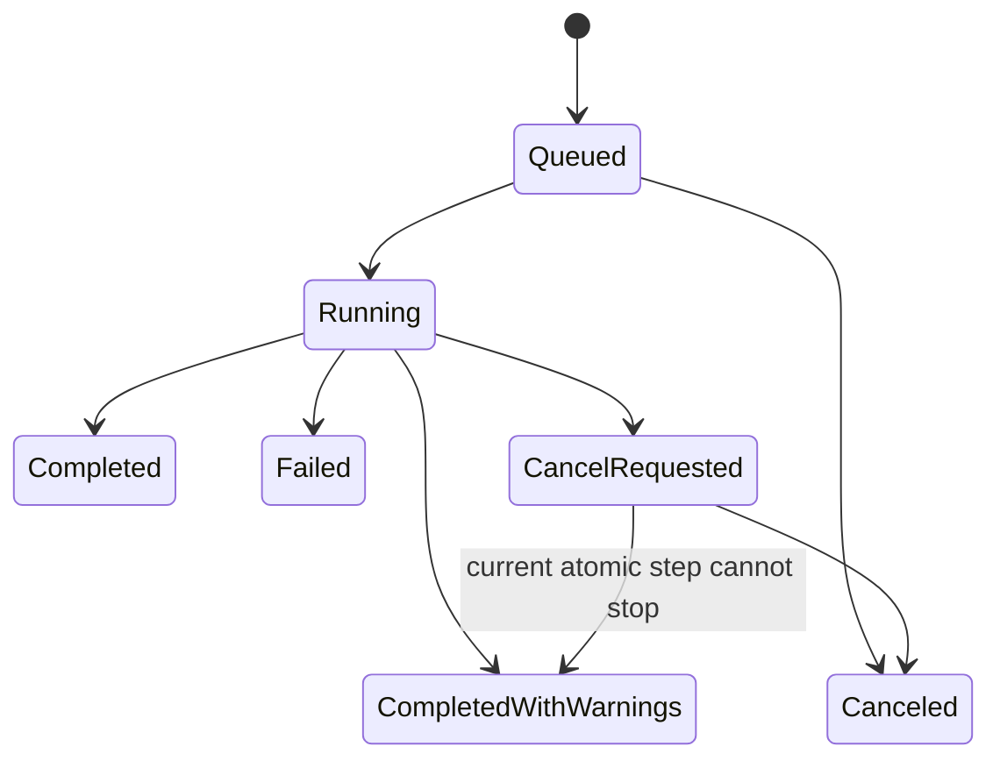
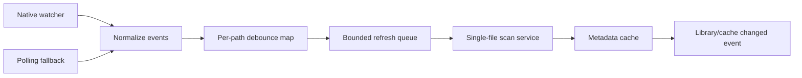

# MKVO Tauri + Rust Architecture and Migration Plan

Status: Proposed target architecture  
Audience: MKVO maintainers, contributors, release engineers, and future plugin authors  
Last reviewed: 2026-08-04

## 1. Executive summary

This document defines how MKV Orchestrator (MKVO) can move from its Avalonia/.NET desktop application and ASP.NET Core companion host to a Tauri desktop application backed by Rust, while retaining the current product features and the Docker/NAS browser experience.

The proposed system has three major parts:

1. A shared React + TypeScript interface derived from the existing `web/` application.
2. A Rust workspace containing domain models, workflow services, persistence, external-tool execution, background jobs, and platform adapters.
3. Two thin delivery hosts:
   - a Tauri desktop host using typed IPC commands and channels;
   - an optional Rust HTTP host for Docker, NAS, and remote-browser access.

The key design rule is that media behavior lives in reusable Rust crates, not in React components, Tauri commands, or HTTP handlers. Tauri and the HTTP server are transport adapters over the same application services.

This is a replacement architecture, not a direct line-by-line port of `MainWindowViewModel` or `MKVOrchestrator.WebHost`.

## 2. Goals

- Preserve all current Dashboard, Rename, Mux/Remux, Track Properties, Library, Settings, and Logs features.
- Preserve MKV and MP4 scanning, metadata caching, TVDB/TMDB lookup, rename preview/apply/undo, MKVToolNix operations, FFmpeg inspection, media-server discovery, live watch folders, background jobs, cancellation, and user themes.
- Reuse the existing React UI and its page-level concepts where practical.
- Make the Rust application core usable by both Tauri and a headless server.
- Keep long-running operations off the UI thread and alive across route changes.
- Keep process arguments, filesystem access, credentials, and local data inside trusted Rust code.
- Preserve safe preview-before-apply behavior for destructive operations.
- Provide a staged migration in which the current product remains releasable.
- Support Windows first, followed by Linux and macOS where external tools are available.

## 3. Non-goals

- Reimplementing MKVToolNix or FFmpeg in Rust.
- Exposing arbitrary shell execution to the frontend.
- Allowing unrestricted filesystem access from JavaScript.
- Combining Tauri IPC and HTTP transport code with domain or workflow logic.
- Requiring bundled MKVToolNix or FFmpeg binaries. The default remains user-installed tools; bundling can be evaluated separately.
- Preserving Avalonia-specific concepts such as `IBrush`, `Window`, `ObservableCollection`, relay commands, or code-behind.

## 4. Current capability inventory

The replacement must cover the following behavior.

| Area | Current behavior | Target owner |
| --- | --- | --- |
| Dashboard | Browse roots, scan folders, inspect tracks, select files, compare against a template | `mkvo-application::scan`, React Dashboard |
| Rename | TVDB/TMDB search, scopes, templates, preview, apply, recent batch history, undo | `mkvo-application::rename` |
| Mux/Remux | Track filtering, sidecar subtitle muxing, extraction, MP4-to-MKV copy, preview/apply | `mkvo-application::remux` |
| Track Properties | Container title and track property editing with preview/apply | `mkvo-application::propedit` |
| Library | Cached library overview, standards profile, warnings, dashboard handoff | `mkvo-application::library_audit` |
| Settings | Tool paths, worker limits, watch folders, API providers, media servers, themes, templates | `mkvo-application::settings` |
| Logs | Operation output, statuses, history, cancellation | `mkvo-application::jobs` and `mkvo-infra::logging` |
| Cache | SQLite metadata cache, validation, cleanup, temporary cache | `mkvo-infra::sqlite` |
| Watch folders | Recursive monitoring, debounce, refresh, stale-entry removal | `mkvo-infra::watch` |
| Media servers | Emby/Jellyfin/Plex connection test, discovery, mapping, sync | `mkvo-infra::media_servers` |
| External tools | `mkvmerge`, `mkvpropedit`, `mkvextract`, `mkvinfo`, `ffmpeg`, `ffprobe` | `mkvo-infra::process` |
| Docker/NAS | Browser UI, configured roots, auth, jobs, cancellation, mounted shares | `mkvo-server` |

## 5. Target system context



## 6. Architectural principles

### 6.1 One application core, multiple transports

Tauri commands and HTTP endpoints call the same application services. They do not duplicate planning, validation, execution, or persistence behavior.

### 6.2 Canonical media model

Rust uses one canonical `MediaFile` domain model. The React UI receives serializable DTOs derived from it. There is no desktop-only row model equivalent to `MkvFileItem`.

### 6.3 Preview and apply are separate operations

Rename, remux, conversion, extraction, and property editing must create immutable plans before execution. Apply commands accept a plan identifier or a request whose fingerprint is verified against the preview.

### 6.4 Explicit resource ownership

- A job supervisor owns background tasks and cancellation tokens.
- A watcher supervisor owns filesystem watchers and debounce tasks.
- A database pool or repository actor owns SQLite connections.
- A process runner owns child-process lifetime and output capture.
- Tauri state owns application-service handles, not mutable feature data copied into the UI.

### 6.5 Bounded concurrency

Scan, edit, and remux concurrency uses bounded queues and semaphores. Tokio recommends explicit bounded channels to provide backpressure rather than allowing unbounded work queues ([Tokio channels](https://tokio.rs/tokio/tutorial/channels)).

### 6.6 Least-privilege frontend

The frontend receives only the commands and filesystem roots it needs. Tauri capabilities constrain what the webview can invoke; capabilities do not replace validation inside Rust commands ([Tauri capabilities](https://v2.tauri.app/security/capabilities/), [runtime authority](https://v2.tauri.app/security/runtime-authority/)).

### 6.7 Contract-first boundaries

Rust request, response, error, job-event, and plan schemas are the source of truth. TypeScript types and validators are generated from those schemas and checked in CI. Tauri IPC and HTTP use the same contract package, with an explicit compatibility version for persisted jobs and remote clients.

This prevents the current desktop, web-host, and frontend models from evolving independently.

### 6.8 Crash-safe and idempotent mutations

Every apply operation has an idempotency key and a persisted operation journal. Before the first filesystem mutation, MKVO records the plan, input fingerprints, intended outputs, and current step. Repeating a request must either return the existing result or safely resume; it must not perform the mutation twice.

### 6.9 Resource-aware scheduling

The job supervisor coordinates work through leases on normalized filesystem resources. Read-only scans can share a file lease, while rename, remux, extraction, conversion, and property editing require exclusive leases for affected inputs and outputs. This prevents a watcher refresh, rescan, or second job from observing or changing a file halfway through another operation.

### 6.10 Events are hints; reconciliation is authoritative

Filesystem events and media-server notifications trigger work, but do not directly define application state. A reconciliation service compares the filesystem, cache, and job journal to compute the authoritative state. This is more reliable on network shares and after suspend, crashes, dropped watcher events, or external file changes.

## 7. Proposed repository layout

```text
mkv-orchestrator/
├── apps/
│   ├── ui/                         # React + TypeScript shared UI
│   │   ├── src/
│   │   │   ├── api/                # BackendClient contract and adapters
│   │   │   ├── components/
│   │   │   ├── features/
│   │   │   │   ├── dashboard/
│   │   │   │   ├── rename/
│   │   │   │   ├── remux/
│   │   │   │   ├── propedit/
│   │   │   │   ├── library/
│   │   │   │   ├── settings/
│   │   │   │   └── logs/
│   │   │   ├── state/
│   │   │   └── types/
│   │   └── package.json
│   ├── desktop/
│   │   └── src-tauri/
│   │       ├── capabilities/
│   │       ├── src/
│   │       │   ├── commands/
│   │       │   ├── events.rs
│   │       │   ├── state.rs
│   │       │   └── lib.rs
│   │       ├── Cargo.toml
│   │       └── tauri.conf.json
│   └── server/
│       ├── src/
│       │   ├── routes/
│       │   ├── auth.rs
│       │   ├── events.rs
│       │   └── main.rs
│       └── Cargo.toml
├── crates/
│   ├── mkvo-domain/
│   ├── mkvo-application/
│   ├── mkvo-contracts/
│   ├── mkvo-infra-sqlite/
│   ├── mkvo-infra-process/
│   ├── mkvo-infra-providers/
│   ├── mkvo-infra-watch/
│   ├── mkvo-infra-media-servers/
│   ├── mkvo-infra-netshare/
│   └── mkvo-test-support/
├── migrations/                     # SQLite migrations
├── fixtures/                       # Sanitized mkvmerge/ffprobe/provider fixtures
├── docs/
└── Cargo.toml                      # Rust workspace
```

Smaller teams may initially combine the infrastructure crates into `mkvo-infrastructure`. The logical boundaries should remain even if the physical crate count starts smaller.

## 8. Rust crate responsibilities

### 8.1 `mkvo-domain`

Pure data and rules with no Tauri, HTTP, SQLite, or process dependencies.

Representative types:

```rust
pub struct MediaFile {
    pub path: PathBuf,
    pub size: u64,
    pub modified_at: OffsetDateTime,
    pub container: ContainerMetadata,
    pub tracks: Vec<MediaTrack>,
    pub attachments: Vec<MediaAttachment>,
    pub provider_match: Option<ProviderMatch>,
}

pub enum TrackKind { Video, Audio, Subtitle, Other }
pub enum VisualState { Normal, Warning, Error, Muted }
pub enum JobStatus { Queued, Running, Completed, Failed, Skipped, Canceled }
pub enum MetadataProvider { Tvdb, Tmdb }
```

Domain modules:

- media identity and track metadata;
- rename tokens, templates, plans, and conflicts;
- remux plans and sidecar subtitle matching;
- property-edit plans and track selector semantics;
- library audit profiles and warnings;
- worker settings and job state;
- path mapping and configured-root rules.

### 8.2 `mkvo-contracts`

Stable serializable request/response/event DTOs shared by Tauri commands, the HTTP server, and generated TypeScript definitions.

Contract rules:

- `serde` camel-case serialization;
- string IDs using UUIDs or newtypes;
- paths serialized as UTF-8 display strings at the UI boundary while Rust retains `PathBuf` internally;
- tagged enums for operation and error kinds;
- no database rows or process objects exposed directly;
- contract version included in status and persisted plan records.

Generate TypeScript types from Rust using a single selected generator. Do not maintain parallel handwritten DTO definitions.

### 8.3 `mkvo-application`

Use cases and workflow coordination.

Suggested service modules:

```text
scan_service
current_selection_service
rename_service
rename_history_service
remux_service
propedit_service
library_audit_service
settings_service
media_server_service
job_supervisor
operation_log_service
watch_folder_service
```

The application layer defines ports such as:

```rust
#[async_trait]
pub trait MediaProbe: Send + Sync {
    async fn inspect(&self, path: &Path, cancel: CancellationToken)
        -> Result<MediaFile, MediaProbeError>;
}

#[async_trait]
pub trait MetadataCache: Send + Sync {
    async fn get_valid(&self, fingerprint: &FileFingerprint)
        -> Result<Option<MediaFile>, CacheError>;
    async fn upsert(&self, file: &MediaFile) -> Result<(), CacheError>;
    async fn remove_under(&self, root: &Path) -> Result<u64, CacheError>;
}
```

### 8.4 Infrastructure crates

- `mkvo-infra-process`: safe process invocation, path discovery, version checks, cancellation, stdout/stderr streaming, and temporary-file promotion.
- `mkvo-infra-sqlite`: migrations and repositories for cache, settings metadata, rename batches, logs, and resumable job summaries.
- `mkvo-infra-providers`: TVDB/TMDB HTTP clients, normalization, retry policy, credential redaction, and response caching.
- `mkvo-infra-watch`: native filesystem watching, polling fallback, debounce, refresh dispatch, and stale cache removal.
- `mkvo-infra-media-servers`: Emby/Jellyfin/Plex discovery, connection tests, per-library selection, and path mapping.
- `mkvo-infra-netshare`: UNC classification and SMB share enumeration, so a NAS that no drive letter points at is still browsable. The only crate permitted to use `unsafe`; the workspace forbids it everywhere else, and this crate exists so that ban stays intact.

## 9. Frontend architecture

### 9.1 Reuse the existing React pages

The existing browser pages already map to the product sections. Move them into feature folders and remove direct assumptions that every backend is HTTP.

### 9.2 Backend adapter

```ts
export interface BackendClient {
  getStatus(): Promise<AppStatus>;
  browseFileSystem(path?: string): Promise<FileSystemResponse>;
  startScan(request: ScanRequest): Promise<JobAccepted>;
  cancelJob(jobId: string): Promise<JobSnapshot>;
  buildRenamePreview(request: RenamePreviewRequest): Promise<RenamePlan>;
  applyRenamePlan(planId: string): Promise<JobAccepted>;
  buildRemuxPreview(request: RemuxPreviewRequest): Promise<RemuxPlan>;
  applyRemuxPlan(planId: string): Promise<JobAccepted>;
  buildPropEditPreview(request: PropEditPreviewRequest): Promise<PropEditPlan>;
  applyPropEditPlan(planId: string): Promise<JobAccepted>;
  subscribeToJob(jobId: string, onEvent: (event: JobEvent) => void): Unsubscribe;
}
```

Implementations:

- `TauriBackendClient`: invokes Rust commands and consumes Tauri channels/events.
- `HttpBackendClient`: uses the Rust server API and server-sent events or WebSocket events.
- `MockBackendClient`: deterministic UI development and component tests.

### 9.3 State ownership

- TanStack Query owns server/backend snapshots and invalidation.
- Feature-local React state owns draft forms and table selection.
- Rust owns jobs, plans, cache state, watcher state, operation logs, and persisted settings.
- The frontend does not treat an in-memory table as the authoritative execution state.

## 10. Tauri host design

### 10.1 Managed application state

```rust
pub struct AppServices {
    pub scan: Arc<ScanService>,
    pub rename: Arc<RenameService>,
    pub remux: Arc<RemuxService>,
    pub propedit: Arc<PropEditService>,
    pub library: Arc<LibraryAuditService>,
    pub settings: Arc<SettingsService>,
    pub jobs: Arc<JobSupervisor>,
    pub watchers: Arc<WatchFolderService>,
}
```

Register this once with Tauri managed state. Commands clone `Arc` handles and immediately delegate to application services.

### 10.2 Command rules

- Use async commands for I/O and long-running preparation. Tauri documents that asynchronous commands avoid blocking the main thread ([calling Rust from the frontend](https://v2.tauri.app/develop/calling-rust/)).
- Commands accept owned DTOs rather than borrowed strings.
- A command may validate and enqueue work, but must not perform a multi-minute remux before responding.
- Commands return a stable `ApiResult<T>` with a typed error envelope.
- Commands do not accept raw executable names or arbitrary argument arrays.

### 10.3 Proposed Tauri commands

| Feature | Commands |
| --- | --- |
| Status | `get_status`, `get_tool_status` |
| Filesystem | `list_directory`, `select_source_folders`, `select_tool_directory` |
| Dashboard | `start_scan`, `get_current_files`, `clear_current_files`, `set_file_selection` |
| Rename | `search_metadata`, `load_episode_scopes`, `build_rename_preview`, `apply_rename_plan`, `list_rename_batches`, `preview_rename_undo`, `undo_rename_batch`, `clear_rename_batches` |
| Remux | `build_remux_preview`, `apply_remux_plan` |
| Properties | `load_propedit_template`, `build_propedit_preview`, `apply_propedit_plan` |
| Library | `build_library_audit`, `send_library_items_to_dashboard` |
| Settings | `get_settings`, `save_settings`, `test_provider`, `test_media_server`, `sync_media_server` |
| Jobs | `get_job`, `cancel_job`, `list_recent_jobs` |
| Logs | `get_logs`, `clear_logs`, `export_logs` |

### 10.4 Progress transport

Commands return quickly with a job ID. Progress is delivered using an ordered Tauri channel for job-specific streams. Tauri recommends channels for ordered or high-throughput data rather than using the general event system ([Tauri commands and channels](https://v2.tauri.app/develop/calling-rust/)).

```rust
pub enum JobEvent {
    Queued { job_id: JobId },
    Started { total: u32 },
    ItemStarted { index: u32, path: String },
    Progress { completed: u32, total: u32, percent: Option<u8> },
    Output { level: LogLevel, message: String },
    ItemCompleted { index: u32, outcome: ItemOutcome },
    Finished { summary: JobSummary },
}
```

The frontend always follows an event with a final `get_job` snapshot so a missed UI event cannot leave stale status.

## 11. Background job model

### 11.1 State machine



### 11.2 Job supervisor

The supervisor stores:

- `JobId` and operation kind;
- idempotency key and correlation ID;
- request fingerprint and optional plan ID;
- normalized read/write resource leases;
- status, timestamps, totals, and per-file outcomes;
- cancellation token;
- event broadcast sender;
- bounded log tail;
- child-process handles for termination;
- durable operation-journal position for mutating work;
- persisted final summary.

Use `tokio_util::sync::CancellationToken` or an equivalent structured cancellation primitive. A cancel request propagates from UI to supervisor to workflow to process runner.

At startup, the supervisor classifies unfinished jobs as resumable, safely retryable, cleanup-required, or manually reviewable. It never labels an interrupted mutation as failed without checking the journal and filesystem outcome.

### 11.3 Concurrency defaults

Retain current safety-oriented defaults:

- scan workers: 4 desktop, configurable;
- property-edit workers: 2;
- remux workers: 1;
- provider requests: bounded and rate-aware;
- watcher refreshes: deduplicated by normalized path.

Worker settings remain common to Tauri and server deployments.

Concurrency limits are applied at two levels: an operation-class semaphore controls total tool pressure, and resource leases prevent conflicting access to the same paths. The scheduler should use fairness or aging so large scans cannot permanently starve interactive edits.

## 12. External-tool execution

### 12.1 Tool registry

`ToolRegistry` resolves and validates:

- `mkvmerge`;
- `mkvpropedit`;
- `mkvextract`;
- `mkvinfo`;
- `ffmpeg`;
- `ffprobe`.

Resolution order:

1. explicit user setting;
2. configured tool directory;
3. known platform install locations;
4. process `PATH`.

Cache path, version, and validation result, but revalidate when settings change.

### 12.2 Process safety

- Use `tokio::process::Command` directly from trusted Rust code.
- Pass every argument as a separate value; never construct a shell command string.
- Set explicit working directories.
- Capture stdout and stderr independently.
- Redact API keys, pins, SMB credentials, and authorization headers.
- Kill the child process tree on cancellation where supported.
- Limit retained output while streaming the full operation to rotating logs if enabled.
- Treat nonzero exit codes and missing expected output files as failures.
- Record the resolved executable path and tool version in every generated plan.
- Validate outputs structurally before promotion; process exit code alone is insufficient.
- Run mutating tools against staged paths whenever the tool permits it.

### 12.3 Sidecars

The preferred MKVO model remains user-installed MKVToolNix and FFmpeg. If a future edition bundles tools, Tauri sidecars require explicit capability permission and platform/architecture-specific binaries ([Tauri sidecars](https://tauri.app/develop/sidecar/)). Bundling also requires a separate licensing and update review.

## 13. Filesystem security

### 13.1 Authorized roots

Maintain a Rust-side `AuthorizedRoots` service containing:

- user-selected source folders;
- configured watch folders;
- enabled media-server library mappings;
- configured output roots;
- app config/cache/log directories.

Every filesystem request resolves and normalizes the path, resolves symlinks when possible, and verifies containment in an authorized root. UI-provided paths are never trusted merely because they came from a native folder picker.

### 13.2 Tauri permissions

Prefer custom Rust commands for media access rather than broad frontend filesystem permissions. If the Tauri filesystem plugin is used for limited UI needs, configure narrow scopes; the plugin supports scoped base-directory paths ([Tauri filesystem plugin](https://v2.tauri.app/plugin/file-system/)).

### 13.3 Mutation rules

- Rename and conversion targets must remain in an authorized output root.
- Preview detects duplicate targets, existing targets, missing parents, read-only files, and cross-volume behavior.
- Plans include canonical input/output paths, size and modification fingerprints, relevant settings hash, tool versions, and an expiry policy.
- Apply re-resolves paths and rejects stale fingerprints, changed settings, unavailable tools, or lost authorization.
- Use temporary output files followed by atomic promotion when supported.
- Do not delete the MP4 source until the MKV output exists, passes basic validation, and the plan requested deletion.
- Undo records contain original path, new path, timestamps, fingerprints, and outcome.

## 14. SQLite and local data

Use SQLite through a Rust repository layer. Either `sqlx` or `rusqlite` is acceptable; select one during the foundation spike and use it consistently.

### 14.1 Proposed tables

```text
schema_version
settings_metadata
media_cache
media_tracks
media_attachments
rename_batches
rename_batch_items
operation_jobs
operation_job_items
operation_journal
operation_logs
provider_cache
watch_state
```

### 14.2 Cache validity

Retain the existing validity strategy:

- normalized path;
- file size;
- modified timestamp;
- parser/tool schema version;
- serialized track payload version.

Optionally add a lightweight content fingerprint for unreliable network-share timestamps. Do not hash entire media files by default.

### 14.3 Migrations

- Run migrations before starting watchers or accepting commands.
- Back up settings and rename history before irreversible migrations.
- Treat media metadata cache as rebuildable.
- Do not silently discard rename history or settings.
- Store schema and application versions separately.

### 14.4 SQLite operating policy

- Keep the database in the local application-data directory, never on a media share.
- Enable foreign keys, a bounded busy timeout, and WAL mode where supported.
- Serialize or tightly bound writes through the repository layer while allowing read concurrency.
- Use transactions for job creation, journal advancement, and final summaries.
- Run periodic checkpoint and integrity checks without blocking active media jobs.
- Export a small diagnostic bundle containing schema version and sanitized integrity results, not secrets or full media paths by default.

## 15. Settings and secrets

Split settings into:

1. ordinary application settings stored as JSON or SQLite;
2. secrets stored through the operating-system credential facility when available.

Secrets include TVDB/TMDB credentials and optional server credentials. The UI receives only `configured: true/false` and masked hints after save. Environment variables remain supported by the server/container host and override stored values according to a documented precedence order.

Suggested precedence:

```text
command-line or container environment
    > secure credential store
    > ordinary settings defaults
```

## 16. Watch-folder architecture

Use the Rust `notify` crate behind a `WatchBackend` trait. It selects native backends where supported and offers a polling fallback. The crate documentation notes that network filesystems may not emit reliable native events and recommends polling as a workaround ([notify documentation](https://docs.rs/notify/latest/notify/)).



Requirements:

- coalesce create/change/rename bursts;
- treat rename as old-path removal plus new-path refresh;
- use the same single-file scan service as Dashboard refresh;
- fall back to periodic reconciliation for network shares;
- remove deleted files and subtrees from cache;
- expose watcher health and backend type in Settings;
- shut down watchers before database and runtime teardown.

## 17. Feature workflows

### 17.1 Dashboard scan

1. UI selects one or more authorized roots.
2. `start_scan` validates roots and creates a job.
3. Enumerator finds supported MKV/MP4 files while applying ignored-folder rules.
4. Cache repository returns valid entries immediately.
5. Missing or stale entries are inspected through `mkvmerge` and/or `ffprobe` under a scan semaphore.
6. Results update cache and the current working set.
7. Job events stream incremental rows and progress.
8. Completion publishes one consolidated selection-change event for Rename.

### 17.2 Rename

1. Selected Dashboard files form the rename source set.
2. Provider search returns normalized TVDB/TMDB results.
3. Scope loading caches episode data by provider, series/movie ID, and language.
4. Preview matches files to episodes and renders destination names.
5. Planner blocks duplicate, invalid, existing, or unauthorized destinations.
6. Apply revalidates source fingerprints and target availability.
7. Each successful rename updates cache/current state and records a batch item.
8. Undo preview revalidates both paths before offering restoration.

### 17.3 Mux, remux, subtitle extraction, and MP4 conversion

1. UI sends selected files and filter/preservation options.
2. Planner produces per-file actions and no-change reasons.
3. Apply creates a background job.
4. Each operation writes to a temporary target where applicable.
5. Rust streams tool progress and output.
6. Successful output is promoted and rescanned.
7. Optional source deletion occurs only after verification.

### 17.4 Track properties

1. Load a template file or construct edits manually.
2. Use a single Rust selector implementation to keep mkvmerge IDs distinct from `mkvpropedit` selectors.
3. Preview generates structured edits and display-safe command summaries.
4. Apply runs bounded concurrent edits.
5. Each successful file is rescanned and cache-updated.

### 17.5 Library audit

1. Read cached files under the selected root.
2. Group by show/season or directory strategy.
3. Establish the expected video/audio/subtitle profile.
4. Report deviations and uncached files.
5. Allow selected problem files to be added to the Dashboard working set without rescanning valid cache entries.

### 17.6 Settings and media servers

- Validate tool paths and report versions.
- Test TVDB/TMDB without persisting failed credentials.
- Test Emby/Jellyfin/Plex and discover libraries.
- Apply per-library enablement and server-to-local path mappings.
- Restart watchers transactionally after watch settings save.
- Keep theme settings in the frontend contract, with validated color/token values.

## 18. HTTP server and Docker/NAS mode

Tauri replaces Avalonia for desktop, but it does not replace remote browser access. Preserve that product capability with `mkvo-server`, most likely using Axum over the same application services.

The existing HTTP routes can remain conceptually stable so the React app needs minimal change. Add:

- server-sent events or WebSockets for job streams;
- explicit API versioning;
- configured-root enforcement in middleware/application services;
- optional basic auth initially, with a future token/reverse-proxy mode;
- graceful shutdown that cancels jobs and stops watchers;
- `/api/health` and `/api/status` endpoints;
- PUID/PGID/UMASK-compatible container entrypoint behavior.

Container builds install MKVToolNix and FFmpeg as today. Desktop builds discover user-installed tools by default.

## 19. Error model and observability

### 19.1 Error envelope

```rust
pub struct ApiError {
    pub code: ErrorCode,
    pub message: String,
    pub operation_id: Option<JobId>,
    pub retryable: bool,
    pub details: Option<serde_json::Value>,
}
```

Error categories:

- validation;
- unauthorized path;
- tool unavailable or incompatible;
- process failure;
- provider/network failure;
- cache/database failure;
- file conflict;
- canceled;
- internal.

### 19.2 Logging

Use structured Rust tracing with:

- operation/job ID;
- feature and action;
- sanitized source basename or explicitly opted-in full path;
- elapsed time and exit code;
- retry and cancellation state.

Never log API keys, PINs, authorization headers, SMB credentials, or full provider payloads containing credentials.

## 20. Security model

- Bundle only local application assets; do not enable remote frontend origins.
- Define an explicit desktop capability file rather than enabling every generated capability.
- Expose custom commands, not generic shell or unrestricted filesystem plugins.
- Apply a restrictive content security policy.
- Validate every path and plan in Rust at execution time.
- Restrict external-tool names and arguments to backend-owned builders.
- Sign desktop releases and publish checksums.
- Audit Rust and npm dependencies in CI.
- Keep updater signing keys outside the repository.

Tauri relies on the operating-system WebView and places native access behind the IPC/capability boundary ([Tauri security overview](https://v2.tauri.app/security/)). Security still depends on the Rust command implementations and configured scopes.

## 21. Testing strategy

### 21.1 Rust unit tests

- path normalization and authorized-root containment;
- natural ordering and episode matching;
- rename token formatting and sanitization;
- duplicate target detection;
- subtitle sidecar parsing;
- track selector semantics;
- cache fingerprint validity;
- library audit grouping and warnings;
- job state transitions and cancellation.

### 21.2 Fixture tests

Store sanitized output fixtures for:

- `mkvmerge -J`;
- `ffprobe` JSON;
- provider search and episode responses;
- Emby/Jellyfin/Plex library responses;
- process progress output.

Parsers run against fixtures without requiring media tools or network access.

### 21.3 Integration tests

- temporary SQLite database with migrations;
- fake process runner with scripted output and exit codes;
- fake providers and media servers;
- filesystem plans against temporary folders;
- watcher debounce and reconciliation;
- full preview/apply/undo cycle on tiny generated fixtures.

### 21.4 Contract tests

Run identical contract cases against:

- direct application services;
- Tauri command wrappers where practical;
- HTTP endpoints;
- generated TypeScript codecs.

### 21.5 UI tests

- React component tests with `MockBackendClient`;
- Playwright browser tests against `mkvo-server`;
- a smaller Tauri smoke suite covering startup, folder selection, scan, cancellation, and settings persistence.

## 22. Build and release design

### 22.1 CI matrix

```text
Rust format + clippy + test
TypeScript lint + typecheck + unit test
Contract generation drift check
Windows Tauri build
Linux Tauri build
macOS Tauri build
Docker server build
Playwright test against Docker server
dependency and license audit
```

Windows remains the release gate during early migration. Linux/macOS failures may initially be allowed only where documented external-tool limitations exist; they should not silently degrade supported features.

### 22.2 Artifacts

- Windows installer and portable archive;
- macOS application bundle after signing/notarization is configured;
- Linux packages selected during the platform spike;
- multi-architecture container image for `mkvo-server`;
- checksums, SBOM, and release notes;
- optional updater metadata after signing infrastructure exists.

## 23. Migration sequence

### Phase 0: Architecture baseline

- Freeze and document current behavior with acceptance tests.
- Capture sanitized process/provider fixtures.
- Define Rust/TypeScript contract naming and versioning rules.
- Decide SQLite library, HTTP framework, type generator, and secret-store approach.
- Record architecture decision records for persistence, contracts, jobs, security, and tool distribution.
- Define measurable startup, scan-throughput, memory, cancellation-latency, and installer-size budgets.
- Record parity criteria for every current screen.

Exit criteria: the existing application has a repeatable feature-parity test checklist.

### Phase 1: Rust workspace and domain model

- Create workspace and CI.
- Port canonical media, track, plan, settings, job, and audit models.
- Generate TypeScript types and runtime validators from the authoritative Rust contracts.
- Add contract snapshots and compatibility checks for Tauri, HTTP, and persisted records.
- Port pure algorithms: natural sorting, rename matching/templates, sidecar parsing, selectors, and conflict rules.
- Add fixture-driven unit tests.

Exit criteria: pure planning results match the current implementation for shared fixtures.

### Phase 2: Process inspection and SQLite

- Implement tool registry and process runner.
- Port `mkvmerge` and `ffprobe` parsing.
- Implement cache schema, repositories, migrations, operation journal, and cleanup.
- Implement idempotency, resource leases, startup recovery classification, and reconciliation.
- Implement single-file and folder scan services.

Exit criteria: Rust scanning produces equivalent media DTOs and cache reuse behavior.

### Phase 3: Tauri shell and shared UI adapter

- Move existing React UI into `apps/ui`.
- Define `BackendClient`.
- Implement Tauri status, filesystem, scan, job, and settings commands.
- Implement channels for progress.
- Add least-privilege capabilities and CSP.
- Add a single typed error envelope and correlation IDs across IPC, jobs, logs, and UI notifications.

Exit criteria: Dashboard scanning works end to end in Tauri.

### Phase 4: Rename parity

- Port provider clients and normalized results.
- Port scope cache, matching, templates, preview, apply, batch history, and undo.
- Add plan expiry, fingerprint/tool/settings revalidation, operation journaling, and cache reconciliation.

Exit criteria: representative TV, absolute-numbered, specials, and movie workflows match current behavior.

### Phase 5: Remux and property parity

- Port remux, subtitle sidecar, extraction, and MP4 conversion plans.
- Port property-edit command building and application.
- Implement process progress, cancellation, staged outputs, structural validation, atomic promotion, and rescan.

Exit criteria: preview/apply behavior and no-change reasons match current fixtures.

### Phase 6: Library, watchers, media servers, themes, and logs

- Port library audit.
- Add watcher supervisor with native and polling modes, backed by authoritative reconciliation.
- Port media-server discovery and mapping.
- Complete settings and themes.
- Complete structured operation logs and export.

Exit criteria: every desktop section meets its parity checklist.

### Phase 7: Rust server and container

- Implement HTTP adapter over application services.
- Wire the existing browser adapter to the Rust API.
- Add auth, roots, job events, Docker build, NAS permissions, and health checks.

Exit criteria: Docker/NAS feature parity with the current web companion.

### Phase 8: Cutover — done 2026-08-08

- Run side-by-side beta releases.
- Provide settings/cache/history migration or documented rebuild behavior.
- Measure scan results and generated plans against the current application.
- Make Tauri the default desktop build only after parity gates pass.
- Retire .NET projects after at least one stable release and rollback window.

`src/MKVOrchestrator.{App,Cli,Core,WebHost}`, `tests/MKVOrchestrator.Tests`,
the solution file and `Directory.Build.props` are deleted. The Rust container
took the default `Dockerfile` and `docker-compose.yml` names, the `dotnet` CI
job is gone, and the publish scripts build Tauri bundles.

One deliberate departure from the bullets above: the retirement happened without
waiting out a stable release and rollback window, because git history is the
rollback and keeping a parallel UI alive was the cost the migration existed to
remove.

`MKVOrchestrator.Cli` went with the cutover, since it depended on `Core`. It is
replaced by `apps/cli`, a third host over the same runtime, carrying the same
four verbs, flag names, and exit codes so existing scripts keep working. The one
behavioural change is `rename`, which now goes through the provider lookup the
UI uses rather than renaming from parsed filenames alone -- that is what supplies
episode titles, and it means the command needs something to search for.

What survives from the .NET era: `tests/parity-fixtures/`, read by eight Rust
test sites, and the legacy settings importer in `mkvo-infra-sqlite`, which reads
the old application's `settings.json` at runtime and is unaffected by the source
deletion.

## 24. Data migration

### Settings

Write a one-time importer for the current `settings.json`. Import ordinary settings, normalize paths, and offer to move credentials into secure storage. Preserve the original file as a backup.

### Metadata cache

If the existing SQLite schema is straightforward to read, import valid entries into the Rust schema. Otherwise declare the cache rebuildable and perform a background rebuild. Never block migration solely to preserve rebuildable cache data.

### Rename history

Rename history is not disposable. Import it or retain a read-only legacy viewer until its configured retention window expires.

### Themes and templates

Import custom themes, preset lists, and rename templates with validation. Report rejected values rather than silently dropping them.

## 25. Feature parity acceptance matrix

| Capability | Required parity evidence |
| --- | --- |
| MKV/MP4 scan | Same files found; equivalent container and track metadata |
| Cache | Valid hits avoid probing; stale files re-probe; deletions prune |
| Dashboard | Multi-root scan, selection, sorting, template comparison, cancellation |
| TVDB/TMDB | Search, language, movie mode, season/scope behavior, provider tests |
| Rename | Same destination names and blocking conflicts for fixtures |
| Undo | Successful batch can be safely previewed and restored |
| Remux | Equivalent track filters, preservation options, sidecar behavior |
| MP4 conversion | Stream copy, temporary output, optional verified source deletion |
| Extraction | Language filters, overwrite policy, status output |
| Property edit | Container title, names, languages, default/forced flags |
| Library | Equivalent grouping, profiles, warnings, dashboard handoff |
| Watchers | Create/change/rename/delete behavior plus network-share reconciliation |
| Media servers | Test, discover, select, map, sync for supported servers |
| Jobs | Progress, refresh recovery, cancellation, final summary |
| Settings | Tool paths, workers, roots, providers, themes, templates persist |
| Logs | Sanitized output, filtering/clear/export, operation correlation |
| Docker | Auth, mounted roots, PUID/PGID/UMASK, health check, browser UI |

## 26. Major risks and mitigations

| Risk | Mitigation |
| --- | --- |
| Behavioral drift during language rewrite | Fixture parity tests and plan-by-plan comparison before apply |
| Main UI becomes coupled to Tauri | `BackendClient` interface with Tauri, HTTP, and mock adapters |
| Long operations die on navigation | Rust-owned job supervisor and queryable snapshots |
| Network watchers miss events | Polling fallback and periodic reconciliation |
| Process cancellation leaves partial files | Temporary outputs, process-tree termination, startup cleanup |
| Unsafe frontend path or shell input | Authorized roots and backend-owned argument builders |
| Provider/API instability | Provider ports, normalized DTOs, fixture tests, retry/rate policy |
| SQLite migration data loss | Transactional migrations and backup policy |
| Platform-specific path behavior | `PathBuf` internally and platform CI fixtures |
| Rewrite delays current releases | Feature-slice migration with current app maintained until cutover |
| Tauri permissions become broad | Explicit command manifest, capabilities, scopes, and security review |

## 27. Decisions to make during Phase 0

1. Use `sqlx` or `rusqlite` for SQLite?
2. Use Axum for `mkvo-server`, or another Rust HTTP framework?
3. Which Rust-to-TypeScript generator becomes authoritative?
4. Which credential-store crate supports the required desktop platforms reliably?
5. Should desktop logs persist in SQLite, rolling files, or both?
6. Should plans be persisted so an interrupted app can display them after restart?
7. What is the supported minimum Windows WebView2 baseline?
8. Are Linux and macOS first-class at initial cutover or post-Windows milestones?
9. Should MKVToolNix/FFmpeg remain user-installed on every desktop platform?
10. How long must legacy rename history remain accessible?

## 28. Recommended first implementation slice

Build a vertical Dashboard slice before porting every service:

1. Rust workspace and contracts.
2. Tool discovery and status.
3. `mkvmerge`/`ffprobe` inspection.
4. SQLite cache.
5. Scan job supervisor and cancellation.
6. Tauri Dashboard commands and progress channel.
7. React `TauriBackendClient`.
8. Side-by-side fixture comparison with the current MKVO scan output.

This slice proves the hardest shared foundations—process execution, filesystem authorization, cache, jobs, IPC, and React integration—without beginning with destructive rename/remux behavior.

## 29. Definition of architectural completion

The migration is architecturally complete when:

- all media business logic runs in reusable Rust crates;
- Tauri commands and HTTP routes are thin adapters;
- all seven user-facing sections use the shared React UI;
- all long operations are Rust-owned, cancellable, observable jobs;
- filesystem and process access is unavailable directly to ordinary frontend code;
- Tauri and Docker/NAS modes pass the same contract and parity suites;
- settings, rename history, and user-created templates/themes migrate safely;
- the .NET implementation can be removed without losing supported behavior or operational history.

## 30. Improvement priorities beyond feature parity

The Tauri/Rust migration should not reproduce every existing architectural compromise. The following improvements are part of the recommended design, in priority order.

| Priority | Improvement | Why it matters | Delivery point |
| --- | --- | --- | --- |
| P0 | Authoritative generated contracts | Prevents Tauri, HTTP, and React models from drifting | Phases 0–1 |
| P0 | Immutable, fingerprinted plans | Stops stale previews from becoming unsafe mutations | Phases 1, 4–5 |
| P0 | Idempotency and operation journal | Makes retries and crash recovery safe | Phase 2 |
| P0 | Path-based resource leases | Prevents scan/watch/edit/remux races | Phase 2 |
| P0 | Authorized-root enforcement | Keeps webview and remote requests inside approved roots | Phases 2–3 |
| P1 | Reconciliation-owned state | Handles missed watcher events, network shares, and external changes | Phases 2 and 6 |
| P1 | Correlated structured telemetry | Makes UI errors, jobs, logs, and child processes traceable end to end | Phases 3 and 6 |
| P1 | Golden parity and contract tests | Detects behavioral drift during the rewrite | Every phase |
| P1 | Explicit performance budgets | Prevents the replacement from being smaller but slower or less responsive | Phases 0, 3, and 8 |
| P2 | Signed updater and rollback channel | Improves release safety after stable parity | After Phase 8 |
| P2 | Optional extension SDK | Allows new metadata providers or audit rules without coupling them to core | Post-cutover only |

P0 items are architectural foundations and should not be deferred. P1 items can arrive incrementally but must be complete before cutover. P2 items are intentionally delayed so the migration does not begin with a plugin platform or release system larger than the application itself.

The recommended implementation remains a modular monolith: one Rust application core with clear crate boundaries and two delivery adapters. Microservices, distributed queues, event sourcing, and runtime-loaded native plugins would add operational risk without solving a current MKVO requirement.
